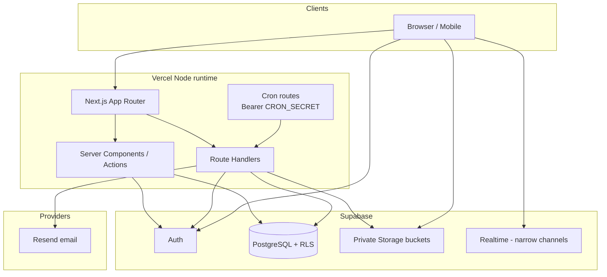

# BayAreaClubs

Production platform for Bay Area school and college clubs: idea → approval →
charter → membership → attendance → events → media → communications → renewal.

This repository is the Next.js App Router application with Supabase PostgreSQL
(RLS), private Storage, Resend email, and Vercel hosting/cron.

**Engineering policy:** [`.specify/memory/constitution.md`](.specify/memory/constitution.md)  
**Production readiness audit:** [`docs/production-readiness.md`](docs/production-readiness.md)

---

## Product overview

BayAreaClubs helps students and advisors:

- submit and review club ideas with governed onboarding (including under-13 flows);
- convert approved ideas into clubs with charters and officer terms;
- manage members, attendance, events/RSVPs, and club media with consent;
- send preference-aware club communications via a durable email outbox;
- publish highlights/newsletters and browse free STEM learning resources;
- review renewals and operate a role-gated Administration Console;
- view operational Insights / Club Momentum (aggregates, not student grading).

Student and private-club data are non-public by default. Authorization is derived
from persisted platform, school, and club assignments—never a single hard-coded
profile role.

---

## Architecture



| Layer | Responsibility |
| --- | --- |
| `src/app` | Routes, layouts, API handlers (including cron) |
| `src/features` | Domain workflows (ideas, clubs, media, email, admin, …) |
| `src/lib` | Auth, Supabase clients, validation, email, security |
| `supabase/migrations` | Immutable schema + RLS |
| `emails` | React Email templates |

---

## Stack

| Concern | Choice |
| --- | --- |
| App | Next.js (App Router), React 19, TypeScript (strict) |
| Package manager | pnpm 12.3.4 · Node.js ≥ 24 |
| UI | Tailwind CSS 4, design tokens under `src/lib/design-tokens.ts` |
| Data | Supabase PostgreSQL + RLS |
| Files | Private Supabase Storage (`club-branding`, `club-media`, `club-documents`, `course-assets`) |
| Email | Resend + durable `communication_jobs` outbox |
| Hosting | Vercel (Node runtime; cron via `vercel.json`) |
| Tests | Vitest, Playwright (+ axe), pgTAP |

Deprecated Edge middleware is not used; session refresh uses the App Router
proxy pattern (`src/proxy.ts`).

---

## Local setup

Requirements: **Node.js 24+**, **pnpm 12.3.4**, Docker (via Colima on macOS) for
local Supabase.

```bash
cp .env.example .env.local
# fill public Supabase URL + publishable key (and optional secrets for full features)
pnpm install
pnpm dev
```

Open [http://localhost:3000](http://localhost:3000).

---

## Supabase setup

### Linked production/staging project

- Project: `bayareaclubs`
- Ref: `kygrtkazmjjutswjbwag`
- Region: `us-west-2`

CLI auth uses `SUPABASE_ACCESS_TOKEN` (from `.env.local` or `~/.supabase/access-token`).
Never commit the token.

```bash
pnpm db:link          # re-link if needed
pnpm db:push:dry      # preview remote migrations
pnpm db:push          # apply pending migrations --linked --yes
```

### Local Docker

```bash
colima start          # macOS
pnpm db:start
pnpm db:reset         # apply all migrations + local seed only
pnpm db:test          # pgTAP
pnpm db:types         # regenerate types from local
```

**Never run development seeds against production.** `pnpm db:push` applies
migrations only; it does not execute `supabase/seed.sql` on the linked project.

---

## Database migration commands

| Command | Purpose |
| --- | --- |
| `pnpm db:push:dry` | Dry-run push to linked remote |
| `pnpm db:push` | Apply pending migrations to linked remote |
| `pnpm db:reset` | Recreate **local** DB from migrations + seed |
| `pnpm db:test` | Run pgTAP against local DB |
| `pnpm db:lint` | Schema lint |
| `pnpm db:types` / `pnpm db:types:linked` | Regenerate TypeScript types |

Migrations live in `supabase/migrations/` and must remain forward-only.

---

## Environment variables

Copy [`.env.example`](.env.example). **Never commit `.env.local` or secrets.**

| Variable | Scope | Purpose |
| --- | --- | --- |
| `NEXT_PUBLIC_APP_URL` | Public | Canonical origin (no trailing slash) |
| `NEXT_PUBLIC_SUPABASE_URL` | Public | Supabase API URL |
| `NEXT_PUBLIC_SUPABASE_PUBLISHABLE_KEY` | Public | Browser/server publishable key |
| `NEXT_PUBLIC_GOOGLE_AUTH_ENABLED` | Public | Show Google OAuth when `true` |
| `SUPABASE_SECRET_KEY` | Server only | Service role for cron/admin jobs |
| `CRON_SECRET` | Server only | Bearer token for `/api/cron/*` |
| `RESEND_API_KEY` | Server only | Outbound email |
| `EMAIL_FROM` | Server only | From address for Resend |
| `SUPABASE_S3_*` | Server only | Optional Storage S3 interface |
| `VERCEL_QUEUES_ENABLED` | Server only | Optional queue adapter (`false` by default) |
| `SUPABASE_ACCESS_TOKEN` | Local CLI | Supabase CLI / `db:push` (not for the app runtime) |

Vercel: set Production / Preview / Development separately. Preview may point at
a non-production Supabase project when available; never reuse production
`SUPABASE_SECRET_KEY` on untrusted Preview branches without a review process.

---

## Testing

```bash
pnpm lint
pnpm typecheck
pnpm test          # Vitest unit tests
pnpm e2e           # Playwright (+ axe on marketing/auth)
pnpm db:test       # pgTAP (local Supabase)
pnpm build
```

See `docs/production-readiness.md` for the latest production-readiness gates.

---

## Deployment

### GitHub

Remote: [https://github.com/mittanshbhatia/bayareaclubs](https://github.com/mittanshbhatia/bayareaclubs)

Push `main` for production deploys after CI-equivalent local gates pass.

### Vercel

1. Link the GitHub repo `mittanshbhatia/bayareaclubs` to a Vercel project.
2. Framework: Next.js · **Node.js 24.x** runtime (not Edge-by-default).
3. Configure env vars for Production, Preview, and Development.
4. Ensure `CRON_SECRET` is set so Vercel Cron sends  
   `Authorization: Bearer <CRON_SECRET>` to cron routes.
5. Deploy production from `main`.

Custom production domains are optional and only configured when DNS credentials
are available.

### Scheduled tasks (`vercel.json`)

| Path | Schedule | Job |
| --- | --- | --- |
| `/api/cron/process-communications` | `*/2 * * * *` | Email/outbox processor (idempotent claims) |
| `/api/cron/renewal-reminders` | `0 16 * * *` | Enqueue + process charter renewal reminders |
| `/api/cron/refresh-analytics` | `15 8 * * *` | Daily analytics rollups (Pacific-oriented) |

All cron handlers fail closed without `CRON_SECRET` and accept **Bearer only**.
Jobs are designed to be idempotent (outbox keys, reminder uniqueness, rollup
upserts). Hobby plan cron frequency limits may force coarsening the outbox
schedule—verify on your Vercel plan.

---

## Storage architecture

- Buckets are **private**: `club-branding`, `club-media`, `club-documents`,
  `course-assets`.
- Postgres stores media **metadata** and consent state; binaries live in Storage.
- Uploads use prepare → upload → finalize with MIME sniffing and bucket allowlists
  (SVG disallowed for branding).
- Reads require authorized `media_assets` rows (path guessing blocked by RLS +
  Storage policies). Club/school visibility respects consent when required.

---

## Role model

Authority is assignment-based:

| Layer | Source | Examples |
| --- | --- | --- |
| Platform | `platform_role_assignments` | `platform_admin`, `committee_reviewer` |
| School | `user_school_memberships` | `school_admin`, advisor, student, staff |
| Club | `club_memberships` (+ officer terms) | `club_admin`, president, officers, member, advisor |

Helpers such as `can_manage_club`, `can_manage_school`, and `is_platform_admin`
are SECURITY DEFINER with empty `search_path` and are used by RLS. Cross-user
role probes soft-deny for non-admins. Under-13 accounts cannot self-signup;
guardians / school admins participate in managed activation and media consent.

Details: [`docs/architecture/rls-matrix.md`](docs/architecture/rls-matrix.md),
[`docs/architecture/authentication.md`](docs/architecture/authentication.md).

---

## Contributing & security

- [CONTRIBUTING.md](CONTRIBUTING.md) — how to propose changes
- [SECURITY.md](SECURITY.md) — vulnerability reporting

Constitution committee: **Mittansh Bhatia** (sole member).
